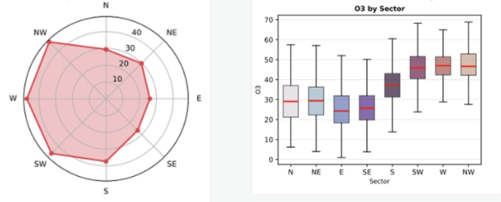
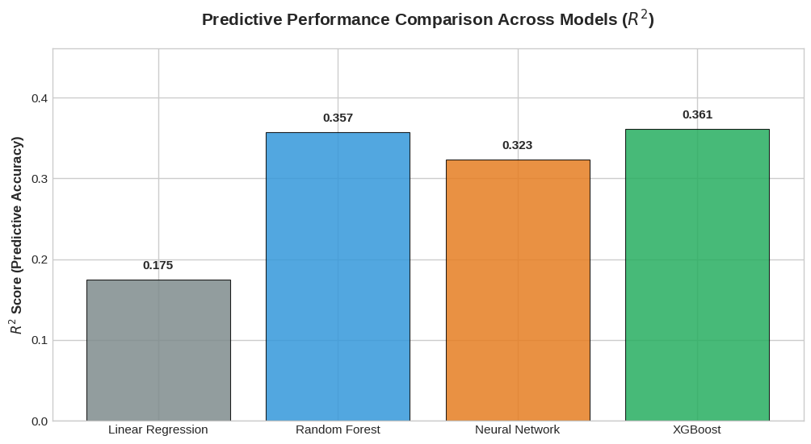
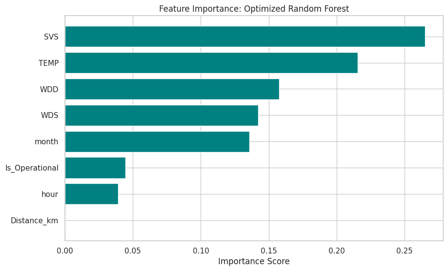

# 🌍 Environmental Air Quality & Ozone ($O_3$) Forecasting
**Collaborative Research with the Sharon-Carmel Municipal Environmental Association**

## 📖 Project Overview
This research analyzes the impact of the **"Leviathan" offshore gas platform** on air quality in the Sharon region, Israel. By integrating Big Data from multiple monitoring stations with advanced Machine Learning architectures, this project investigates whether the platform's activation led to a systematic increase in Ozone ($O_3$) concentrations.

## 🧭 Methodological Justification: Why Westerly Winds?
To isolate the platform's impact, the analysis focuses strictly on **Stable Westerly Winds**. Spatial sector analysis confirms that the highest Ozone concentrations arrive from the West (W) and North-West (NW) sectors—directly correlating with the offshore platform's location.

  

## 📊 Key Results & Statistical Audit
Our multi-stage analysis provides strong evidence of an operational impact on inland Ozone levels:

*   **Predictive Power:** The optimized **XGBoost** model achieved an **$R^2$ score of 0.361**, outperforming baseline linear models.
*   **Physical Contribution (Theta):** Linear Regression analysis revealed that the platform's operational status is a primary driver, with a **Theta coefficient of 2.31** (the highest among predictors).
*   **Error Reduction:** Optimized models achieved an **RMSE to STD ratio of 0.81**, reducing prediction uncertainty by approximately 19% compared to natural data variance.
*   **Significant Shifts:** Pairwise Mann-Whitney U tests confirmed significant increases ($p < 0.05$), with a **12.6% rise** recorded at the "Hamapil" station.

  

## 🤖 Machine Learning & Feature Importance
### Driving Factors
The models consistently identified meteorological factors and operational status as the primary drivers of Ozone formation. The high importance of temperature and radiation aligns with the photochemical nature of $O_3$ production.

  

### The AI Advantage
*   **Predictive Models:** Compared Random Forest, XGBoost, and Neural Networks (64/32 architecture).
*   **Knowledge Extraction:** Leveraged Large Language Models (LLMs) to synthesize technical reports and scientific literature.

## 🛠️ Tech Stack
*   **Languages:** Python (Pandas, NumPy, SciPy)
*   **ML Frameworks:** Scikit-learn, XGBoost
*   **Visualization:** Matplotlib, Seaborn
*   **Environment:** Google Colab

---
*Note: For academic or professional inquiries, please refer to the `Code.ipynb` file or contact me via GitHub.*
