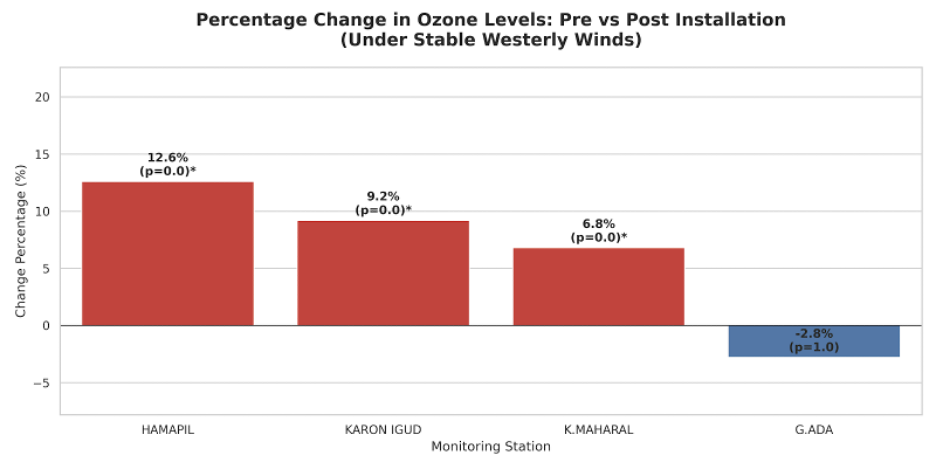
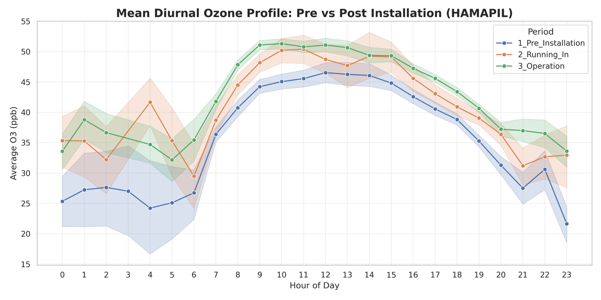
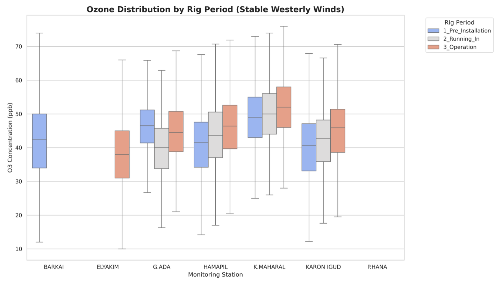

# 🌍 Environmental Air Quality & Ozone ($O_3$) Forecasting
**Collaborative Research with the Sharon-Carmel Municipal Environmental Association**

## 📖 Project Overview
This research analyzes the impact of the **"Leviathan" offshore gas platform** on air quality in the Sharon region, Israel. By integrating **Big Data** from multiple monitoring stations with **Large Language Models (LLMs)**, this project investigates whether the platform's activation led to a systematic increase in Ozone ($O_3$) concentrations.

## 🧭 Methodological Justification: Why Westerly Winds?

*Before analyzing the periods, I conducted a spatial sector analysis. The **Radar Plot** and **Sector Boxplot** clearly demonstrate that the highest Ozone concentrations consistently arrive from the **West (W)** and **North-West (NW)** sectors—directly correlating with the offshore platform's location.*

## 📊 Key Impact Summary

*Significant increases in average $O_3$ levels were recorded at coastal stations, with a **12.6% rise** at the "Hamapil" station ($p < 0.0001$).*

## 🛠️ Data Engineering & Methodology
To handle real-world "dirty" data, I implemented a multi-stage pipeline:
* **Smart Imputation:** Used **KNN** for wind values and **Linear Regression** for weather data.
* **Feature Engineering:** Isolated **stable westerly winds** (25th-75th percentile speeds) to accurately track pollutants arriving from the sea.

## 🔬 Deep Dive: Patterns & Distributions
### 1. Diurnal Photochemical Signature

*The daily profile reveals that the most substantial increases occur during peak sunlight hours (12:00–16:00), indicating enhanced photochemical production.*

### 2. Systematic Shift in Concentrations

*The boxplot analysis confirms a systematic upward shift in Ozone distributions during the full operation period, rather than isolated extreme events.*

## 🤖 AI & Innovation: The LLM Edge
* **Scientific Insight Extraction:** Leveraging LLMs to analyze scientific literature and technical reports.
* **Pattern Comparison:** Using AI to compare local pollution trends with global research findings.

## 💻 Tech Stack
* **Languages:** Python (Pandas, NumPy, Scikit-learn, SciPy)
* **AI/LLMs:** Integration of Large Language Models for text analysis.
* **Visualization:** Matplotlib, Seaborn

---
*Note: Due to confidentiality agreements, raw datasets are not included. For inquiries, please contact me.*
